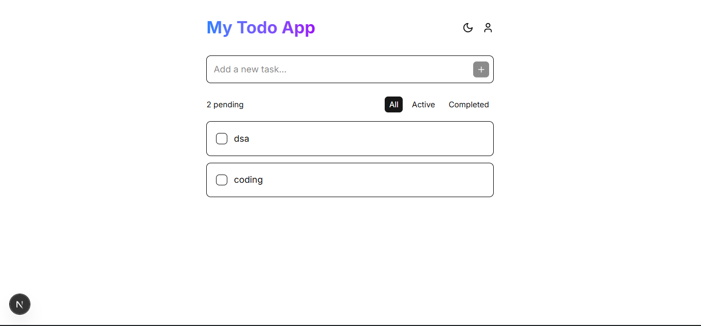
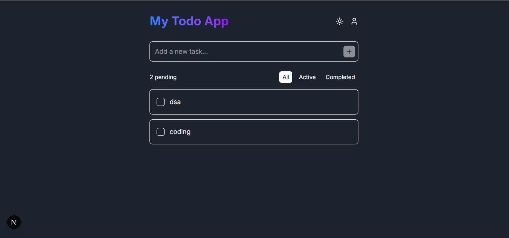

# 📝 Todo App (Full Stack Next.js)

A **feature-rich Todo application** built with **Next.js (frontend + backend)**.
It includes **user authentication, user-specific todos, and theme support (dark/light mode)**.

---

## ✨ Features

* 🔐 **User Authentication**

  * Register & Login functionality
  * Session-based authentication (no JWT)

* ✅ **User-Specific Todos**

  * Each user can manage their own todos
  * CRUD operations (Add, View, Delete todos)

* 🌙 **Dark/Light Mode**

  * Toggle between dark and light themes

* ⚡ **Full-stack in Next.js**

  * Frontend and backend both are written in Next.js
  * API routes (`route.js`) handle backend logic

---

## 🛠️ Tech Stack

* **Frontend:** Next.js (App Router)
* **Backend:** Next.js API Routes
* **Authentication:** Session-based auth
* **Database:** MongoDB Atlas (Mongoose)
* **Styling:** Tailwind CSS (with dark mode)

---

## 🚀 Getting Started

### 1️⃣ Clone the repository

```bash
git clone https://github.com/iamowais123/TODO-APP-NEXT-JS.git
cd TODO-APP-NEXT-JS
```

### 2️⃣ Install dependencies

```bash
npm install
```

### 3️⃣ Setup Environment Variables

Create a `.env.local` file in the root directory and add:

```env
DB_URL=your-mongodb-uri-here
```

*(Never push your `.env` file to GitHub!)*

### 4️⃣ Run the development server

```bash
npm run dev
```

Now app will be running at 👉 `http://localhost:3000`

---

## 📂 Folder Structure

```
todo-app/
│-- app/
│   │-- api/         # API routes (backend logic)
│   │-- components/  # Reusable components
│   │-- (auth)/      # Register/Login pages
│   │-- (todos)/     # Todo-related pages
│-- lib/             # DB & auth configs
│-- public/          # Static assets
│-- styles/          # Tailwind CSS
│-- .env.local       # Environment variables (ignored in git)
```

---

## 🔒 Authentication

* Uses **session-based authentication** (cookie stored in browser)
* Safer for server-rendered apps than JWT in this use case
* Only logged-in users can view & manage their todos

---

## 🌗 Theme Support

* Default: System theme (detects OS preference)
* Manual toggle between **Dark** 🌙 and **Light** ☀️

---


## 📸 Screenshots

### ✅ Todo Page (Light Mode)


### 🌙 Todo Page (Dark Mode)



---

## 🛡️ Best Practices Followed

* Environment variables are hidden (`.env` not committed)
* Secure session-based auth
* Clean folder structure
* Responsive design with Tailwind

---

## 🤝 Contributing

Contributions are welcome!

* Fork the repo
* Create a new branch (`feature-xyz`)
* Commit changes and push
* Create a PR 🎉

---

## 📜 License

This project is licensed under the **MIT License**.